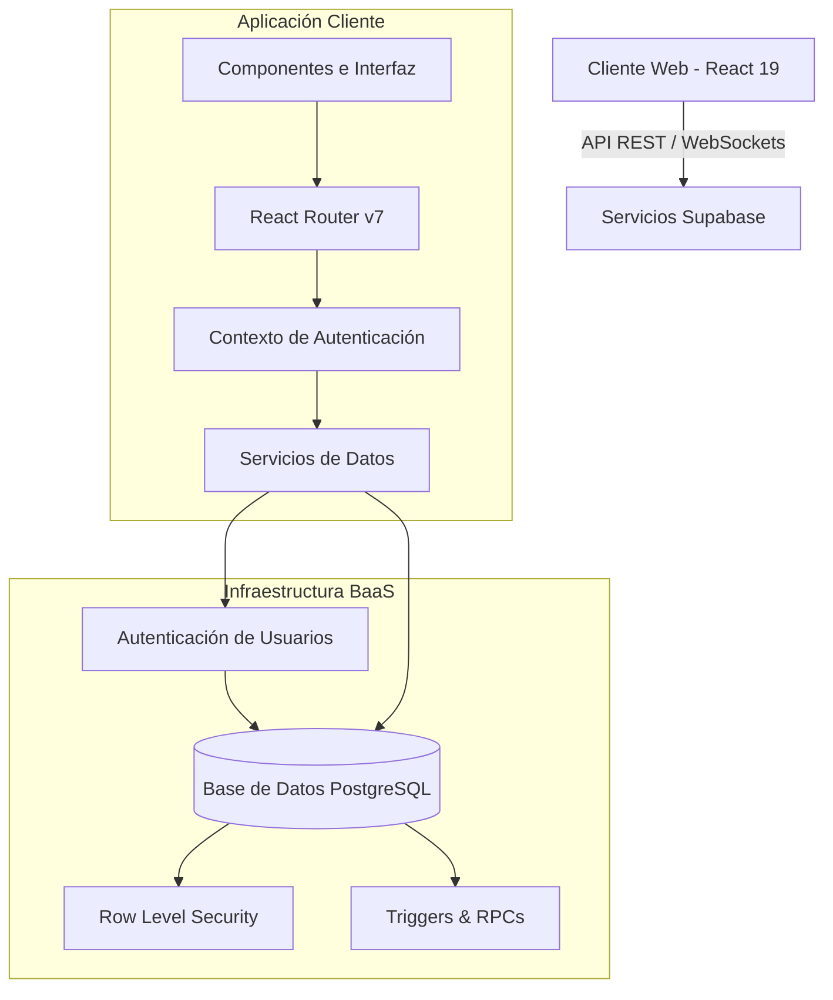

# ReservaAula - Sistema de Gestión de Reservas e Incidencias

Una aplicación web interactiva y modular diseñada para centralizar y optimizar la reserva de recursos (aulas, laboratorios, carritos de portátiles, etc.) en el centro educativo IES ALfredo Kraus.

---

##  Stack Tecnológico

### Frontend
*   **React 19** & **Vite**: Renderizado ágil de componentes y entorno de desarrollo ultra veloz.
*   **React Router v7**: Enrutamiento declarativo para la navegación SPA (Single Page Application).
*   **CSS Vanilla**: Diseño e interfaz de usuario a medida, responsivo, moderno y sin dependencias de frameworks pesados.

### Backend (BaaS)
*   **Supabase**: Servicio de autenticación administrado y base de datos relacional.
*   **PostgreSQL**: Motor de base de datos con extensiones avanzadas (`pgcrypto`, `btree_gist`), triggers automáticos para el mantenimiento de marcas temporales y funciones programadas en PL/pgSQL.

---

##  Arquitectura del Sistema



---

##  Estructura del Proyecto

```text
├── reservarecursos/
│   ├── public/              # Recursos estáticos públicos (iconos, imágenes)
│   ├── src/
│   │   ├── app/             # Rutas, contexto de autenticación y AppShell base
│   │   ├── components/      # Componentes de UI comunes y reutilizables
│   │   ├── lib/             # Servicios de base de datos y utilidades de fecha/colores
│   │   ├── pages/           # Vistas principales (Calendario, Reservas, Incidencias, Perfil)
│   │   ├── App.jsx          # Componente raíz de React
│   │   └── main.jsx         # Punto de entrada de la aplicación
│   ├── package.json         # Dependencias y scripts de ejecución
│   └── vite.config.js       # Configuración del empaquetador Vite
└── .gitignore               # Configuración unificada de exclusión de Git
```

---

##  Instalación y Configuración Local

### 1. Clonar el repositorio y acceder al proyecto:
```bash
git clone https://github.com/AKDAM26/ReservaRecursos.git
cd ReservaRecursos/reservarecursos
```

### 2. Instalar dependencias del frontend:
```bash
npm install
```

### 3. Configurar variables de entorno:
Renombra el archivo `.env.example` a `.env.local` en la raíz de la carpeta `reservarecursos/` y rellena las credenciales obtenidas de tu proyecto en Supabase:
```env
VITE_SUPABASE_URL=tu-url-de-supabase
VITE_SUPABASE_ANON_KEY=tu-clave-anonima-de-supabase
```

### 4. Lanzar el entorno de desarrollo:
```bash
npm run dev
```
Abre tu navegador en [http://localhost:5173](http://localhost:5173) para interactuar con la aplicación.
